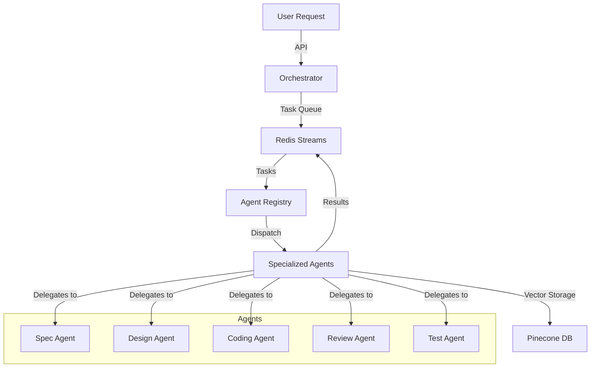

# 🤖 Agent Blackwell

<div align="center">


**A modular LLM-powered agent orchestration system featuring autonomous agents working together via Redis streams and Pinecone vector DB**

</div>

## 🌟 Overview

Agent Blackwell is a cutting-edge orchestration system that harnesses the power of multiple specialized AI agents working in concert to transform requirements into working software. By decomposing complex tasks into specialized workflows, Agent Blackwell delivers higher-quality results than single-LLM approaches, with enhanced reliability, transparency, and control.

### 🚀 Business Value

- **Massive Productivity Boost** - Automates routine coding tasks, allowing developers to focus on high-level architecture and business-critical features
- **24/7 Development Cycle** - Agents work around the clock, accelerating project timelines dramatically
- **Knowledge Augmentation** - Captures and applies best practices, ensuring consistent quality across projects
- **Scalable Expertise** - Supplements team knowledge with specialized agents trained in security, testing, and optimization
- **Reduced Technical Debt** - Built-in code review and testing agents ensure high-quality output from the start

## 🧠 How It Works: The Symphony of Agents

Imagine an orchestra where each musician is a specialized AI agent. When a feature request arrives, it kicks off a carefully choreographed performance:

1. **The Conductor (Orchestrator)** receives your feature request and coordinates the entire process through Redis streams—like musical notes flowing between performers.

2. **The Composer (Spec Agent)** transforms your high-level ideas into a detailed specification—akin to turning a musical theme into a complete score with parts for each instrument.

3. **The Architect (Design Agent)** visualizes the system structure with Mermaid diagrams and API contracts—sketching the blueprint before construction begins.

4. **The Builder (Coding Agent)** crafts the actual code modules—like a master craftsman turning architectural plans into tangible structures.

5. **The Inspector (Review Agent)** meticulously examines the code for quality and security issues—acting as a diligent quality control officer finding subtle flaws before they cause problems.

6. **The Scientist (Test Agent)** develops comprehensive test suites—experimenting with the code under various conditions to ensure it performs reliably.

Each agent specializes in what it does best, and together they create high-quality software faster than traditional approaches. The magic happens through:

- **Redis Streams**: A flowing river of tasks and results that agents tap into
- **Pinecone Vector DB**: The collective memory that helps agents learn from past work
- **Agent Registry**: The talent manager ensuring the right agent handles the right job

## 🏗️ Architecture



## 💻 Tech Stack

- **Core Runtime**: Python 3.11+
- **Framework**: FastAPI
- **Agent Technology**: LangChain with GPT-4
- **Message Broker**: Redis Streams
- **Vector Database**: Pinecone
- **Containerization**: Docker
- **Orchestration**: Kubernetes with Helm
- **Monitoring**: Prometheus & Grafana
- **ChatOps**: Slack API Integration

## 🧠 Specialized Agents: The Dream Team

### 🔍 Spec Agent: The Requirements Whisperer
Transforms vague user requests like "I need user authentication" into detailed specifications with user stories, acceptance criteria, and a breakdown of subtasks. It's like having a business analyst who never misses important details.

### 📐 Design Agent: The System Architect
Creates beautiful architecture diagrams and API contracts that visualize how components will fit together. It considers scalability, security, and best practices—laying the groundwork for rock-solid implementations.

### 👨‍💻 Coding Agent: The Master Craftsman
Generates clean, production-ready code that follows your team's coding standards. Whether it's a complex algorithm or boilerplate CRUD operations, this agent writes code that humans will actually enjoy maintaining.

### 🔬 Review Agent: The Quality Guardian
Scans code with a magnifying glass, finding subtle bugs, security vulnerabilities, and performance bottlenecks before they reach production. It's like having a senior developer review every line of code 24/7.

### 🧪 Test Agent: The Confidence Builder
Creates comprehensive test suites that verify functionality, catch edge cases, and maintain high coverage metrics. It ensures your application remains stable as it evolves—protecting against regressions and unexpected behavior.

## 🛠️ Getting Started

### Prerequisites

- Python 3.11+
- Redis server
- OpenAI API key
- Pinecone API key
- Slack API key

### Installation

```bash
# Clone the repository
git clone https://github.com/yourusername/Agent_Blackwell.git
cd Agent_Blackwell

# Create a virtual environment
python -m venv venv
source venv/bin/activate  # On Windows: venv\Scripts\activate

# Install dependencies
poetry install

# Set up environment variables
export OPENAI_API_KEY="your-openai-key"
export PINECONE_API_KEY="your-pinecone-key"
export SLACK_API_KEY="your-slack-key"
```

### Running the System

```bash
# Start Redis server (if not already running)
redis-server

# Start the orchestrator
python -m src.orchestrator.main
```

## 📝 Real-World Example

Imagine you need to add a user authentication system. Here's how Agent Blackwell transforms that request into working code:

```python
from src.orchestrator.main import Orchestrator

# Initialize the orchestrator
orchestrator = Orchestrator(
    openai_api_key="your-openai-key",
    pinecone_api_key="your-pinecone-key",
    slack_api_key="your-slack-key"
)

# Start the orchestrator
await orchestrator.start()

# Submit a feature request
task = {
    "task_id": "auth-feature-123",
    "task_type": "spec",
    "payload": {
        "description": "Create a user authentication module with JWT support, password reset functionality, and social login options"
    }
}

# The magic begins here!
result = await orchestrator.process_task(task)
```

### What Happens Behind the Scenes:

1. The **Spec Agent** breaks this down into detailed tasks:
   - User registration endpoint
   - JWT token generation and validation
   - Password reset flow with email verification
   - OAuth integration for social logins

2. The **Design Agent** creates:
   - An authentication flow diagram
   - API endpoint specifications
   - Database schema for user accounts

3. The **Coding Agent** generates:
   - User model classes
   - API route handlers
   - JWT middleware for authentication
   - Password hashing utilities

4. The **Review Agent** verifies:
   - Security best practices
   - Input validation
   - Error handling completeness
   - Code style and documentation

5. The **Test Agent** creates:
   - Unit tests for each component
   - Integration tests for the authentication flow
   - Performance tests for token validation
   - Mocked dependencies for isolated testing

## 🔄 The Agent Workflow

1. **Task Reception**: A task enters the system via API or Slack command
2. **Task Queuing**: The task is placed in a Redis stream for processing
3. **Agent Assignment**: The Orchestrator matches the task to the appropriate agent
4. **Task Processing**: The agent performs its specialized work on the task
5. **Result Streaming**: Results flow back through Redis to the Orchestrator
6. **Knowledge Storage**: Insights and artifacts are stored in Pinecone for future reference
7. **Task Chaining**: Results can trigger new tasks for other agents (e.g., code → review)
8. **Status Updates**: Progress is visible through API endpoints or Slack notifications

## 🧪 Testing

Run the test suite with pytest:

```bash
pytest
```

## 📈 Roadmap

- [x] CircleCI integration for CI/CD pipeline
- [ ] Kubernetes Helm charts for deployment
- [ ] Slack ChatOps integration
- [ ] Prometheus & Grafana dashboards
- [ ] ML pipeline for agent evaluation and retraining

## 🤝 Contributing

Contributions, issues, and feature requests are welcome! Feel free to check the issues page.

## 📄 License

This project is licensed under the MIT License - see the LICENSE file for details.

---

<div align="center">
Built with ❤️ and AI
</div>
