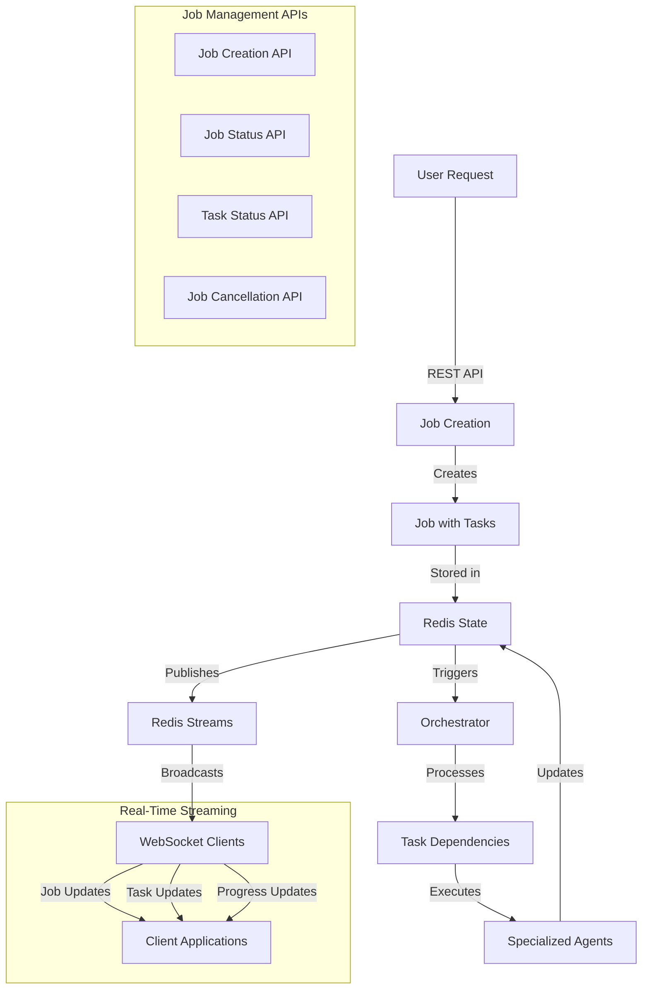
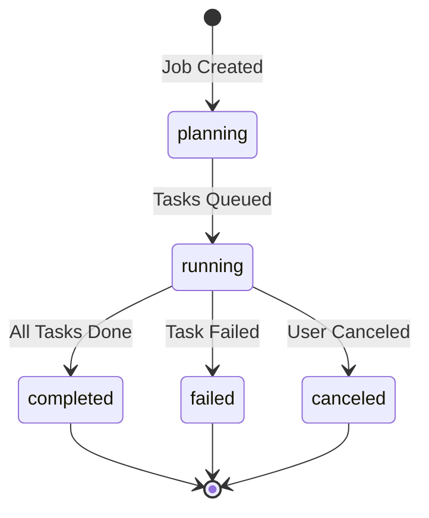

# 🤖 Agent Blackwell

<div align="center">


**A job-oriented AI agent orchestration system with real-time streaming capabilities**

</div>

## 🌟 Overview

Agent Blackwell is a sophisticated orchestration system that transforms user requests into structured jobs with dependent tasks, executed by specialized AI agents. The system features real-time WebSocket streaming, comprehensive job management APIs, and robust state persistence through Redis.

### 🚀 Key Features

- **Job-Oriented Architecture** - Breaks down complex requests into manageable jobs with dependent tasks
- **Real-Time Streaming** - WebSocket endpoints for live job and task status updates
- **Comprehensive APIs** - Full REST API for job creation, monitoring, and management
- **Redis State Management** - Persistent job and task state with Redis Hashes and Streams
- **Agent Coordination** - Specialized agents work together through structured task dependencies
- **Production Ready** - Comprehensive test coverage with integration and streaming tests

## 🏗️ Architecture



## 💻 Tech Stack

- **Core Runtime**: Python 3.11+ with Poetry
- **Web Framework**: FastAPI with async support
- **State Management**: Redis (Hashes for state, Streams for events)
- **Real-Time Communication**: WebSocket with connection management
- **Data Validation**: Pydantic models with comprehensive validation
- **Testing**: Pytest with async and WebSocket support
- **Containerization**: Docker with Docker Compose

## 🛠️ Getting Started

### Prerequisites

- Python 3.11+
- Redis server (standalone or Docker)
- Poetry for dependency management

### Installation

```bash
# Clone the repository
git clone https://github.com/your-org/agent-blackwell.git
cd agent-blackwell

# Install dependencies with Poetry
poetry install

# Activate virtual environment
poetry shell

# Copy environment template
cp .env.example .env
```

### Configuration

Edit `.env` file with your settings:

```bash
# Redis Configuration
REDIS_URL=redis://localhost:6379/0

# API Configuration
PORT=8000
HOST=0.0.0.0

# Logging
LOG_LEVEL=INFO
```

### Running the System

#### Option 1: Docker Compose (Recommended)

```bash
# Start all services
docker-compose up -d

# View logs
docker-compose logs -f app
```

#### Option 2: Manual Setup

```bash
# Terminal 1: Start Redis
redis-server

# Terminal 2: Start the API server
poetry run uvicorn src.api.main:app --host 0.0.0.0 --port 8000 --reload
```

The API will be available at `http://localhost:8000` with interactive docs at `http://localhost:8000/docs`.

## 📋 Job Management System

### Core Concepts

#### Jobs
A **Job** represents a high-level user request that gets broken down into executable tasks:
- Unique job ID and user request description
- Status tracking (planning → running → completed/failed/canceled)
- Task dependency management
- Progress metrics and timestamps

#### Tasks
**Tasks** are individual units of work within a job:
- Assigned to specific agent types (design, code, review, test)
- Status lifecycle (pending → queued → running → completed/failed)
- Dependency relationships between tasks
- Results and execution metadata

### Job Lifecycle



### Task Dependencies

Tasks can depend on other tasks, creating execution workflows:

```python
# Example: Authentication system job
tasks = [
    Task(id="design-auth", agent_type="design", dependencies=[]),
    Task(id="code-models", agent_type="code", dependencies=["design-auth"]),
    Task(id="code-api", agent_type="code", dependencies=["code-models"]),
    Task(id="test-auth", agent_type="test", dependencies=["code-api"]),
    Task(id="review-all", agent_type="review", dependencies=["test-auth"])
]
```

## 🔌 API Reference

### Job Management Endpoints

#### Create Job
```http
POST /api/v1/jobs/
Content-Type: application/json

{
  "user_request": "Build a user authentication system",
  "priority": "high",
  "tags": ["auth", "security"]
}
```

#### Get Job Status
```http
GET /api/v1/jobs/{job_id}
```

Response:
```json
{
  "job_id": "uuid",
  "user_request": "Build a user authentication system",
  "status": "running",
  "tasks": [...],
  "progress": {
    "completed_tasks": 2,
    "total_tasks": 5,
    "percentage": 40.0
  },
  "created_at": "2024-01-01T00:00:00Z",
  "updated_at": "2024-01-01T00:05:00Z"
}
```

#### Get Task Status
```http
GET /api/v1/jobs/{job_id}/tasks/{task_id}
```

#### Cancel Job
```http
POST /api/v1/jobs/{job_id}/cancel
```

#### List Jobs
```http
GET /api/v1/jobs/?status=running&limit=10&offset=0
```

### Real-Time Streaming Endpoints

#### Job-Specific Updates
```javascript
// Connect to specific job updates
const ws = new WebSocket('ws://localhost:8000/api/v1/streaming/jobs/{job_id}');

ws.onmessage = (event) => {
  const update = JSON.parse(event.data);
  console.log('Job update:', update);
};
```

#### Global Job Updates
```javascript
// Connect to all job updates
const ws = new WebSocket('ws://localhost:8000/api/v1/streaming/jobs');

ws.onmessage = (event) => {
  const update = JSON.parse(event.data);
  console.log('Global update:', update);
};
```

#### Streaming Event Types

**Job Status Events:**
```json
{
  "event_type": "job_status",
  "job_id": "uuid",
  "status": "running",
  "tasks": [...],
  "progress": {...},
  "timestamp": "2024-01-01T00:00:00Z"
}
```

**Task Status Events:**
```json
{
  "event_type": "task_status",
  "job_id": "uuid",
  "task_id": "uuid",
  "status": "completed",
  "agent_type": "code",
  "result": {...},
  "timestamp": "2024-01-01T00:00:00Z"
}
```

**Task Result Events:**
```json
{
  "event_type": "task_result",
  "job_id": "uuid",
  "task_id": "uuid",
  "result": "Generated authentication middleware",
  "timestamp": "2024-01-01T00:00:00Z"
}
```

## 🧪 Testing

### Running Tests

```bash
# Run all tests
poetry run pytest

# Run specific test suites
poetry run pytest tests/test_orchestrator_integration.py -v
poetry run pytest tests/test_job_api_endpoints.py -v
poetry run pytest tests/test_streaming_endpoints.py -v

# Run with coverage
poetry run pytest --cov=src --cov-report=html
```

### Test Coverage

The system includes comprehensive test coverage:

- **Orchestrator Integration Tests**: 11 tests covering job/task workflow
- **API Endpoint Tests**: 16 tests covering all REST endpoints
- **Streaming Tests**: 18 tests covering WebSocket and real-time features
- **Total**: 45+ integration tests with 100% pass rate

### Test Categories

1. **Unit Tests**: Individual component testing
2. **Integration Tests**: Cross-component workflow testing
3. **API Tests**: REST endpoint validation
4. **Streaming Tests**: WebSocket and real-time event testing
5. **Load Tests**: Performance and concurrency validation

## 📁 Project Structure

```
agent-blackwell/
├── src/
│   ├── api/
│   │   ├── main.py              # FastAPI application
│   │   └── v1/
│   │       ├── jobs/            # Job management endpoints
│   │       ├── streaming/       # WebSocket streaming endpoints
│   │       └── chatops/         # Data models and schemas
│   ├── orchestrator/
│   │   └── main.py              # Job and task orchestration
│   └── agents/                  # Specialized agent implementations
├── tests/
│   ├── test_orchestrator_integration.py
│   ├── test_job_api_endpoints.py
│   └── test_streaming_endpoints.py
├── docs/
│   ├── API_DOCUMENTATION.md
│   ├── REDIS_PERSISTENCE_STRATEGY.md
│   └── STREAMING_ARCHITECTURE.md
├── docker-compose.yml
├── pyproject.toml
└── README.md
```

## 🔍 Monitoring and Observability

### Health Checks

```http
GET /health                    # API health
GET /api/v1/streaming/health   # Streaming service health
```

### Redis Monitoring

```bash
# Monitor Redis streams
redis-cli XREAD STREAMS job-stream:* $

# Check job state
redis-cli HGETALL job:{job_id}

# Monitor task state
redis-cli HGETALL task:{task_id}
```

### WebSocket Connection Monitoring

The system tracks active WebSocket connections and provides metrics through the streaming health endpoint.

## 🚀 Deployment

### Docker Deployment

```bash
# Build and deploy
docker-compose up -d

# Scale services
docker-compose up -d --scale app=3
```

### Environment Variables

```bash
# Production settings
REDIS_URL=redis://redis-cluster:6379/0
LOG_LEVEL=WARNING
WORKERS=4

# Security
CORS_ORIGINS=["https://yourdomain.com"]
```

## 🛣️ Roadmap

### Current Status ✅
- [x] Job-oriented architecture with task dependencies
- [x] Real-time WebSocket streaming
- [x] Comprehensive REST APIs
- [x] Redis state persistence and event streaming
- [x] Full integration test coverage

### Next Phase 🔄
- [ ] Agent coordination enhancements
- [ ] Performance optimizations
- [ ] Monitoring and alerting improvements
- [ ] Authentication and authorization
- [ ] Production deployment guides

### Future Features 🔮
- [ ] Multi-tenant job isolation
- [ ] Advanced task scheduling algorithms
- [ ] Agent performance analytics
- [ ] Workflow templates and reusability
- [ ] Integration with external CI/CD systems

## 🤝 Contributing

1. Fork the repository
2. Create a feature branch (`git checkout -b feature/amazing-feature`)
3. Make your changes with tests
4. Run the test suite (`poetry run pytest`)
5. Commit your changes (`git commit -m 'Add amazing feature'`)
6. Push to the branch (`git push origin feature/amazing-feature`)
7. Open a Pull Request

## 📄 License

This project is licensed under the MIT License - see the LICENSE file for details.

---

<div align="center">
Built with ❤️ and AI • Real-time streaming • Job-oriented architecture
</div>
