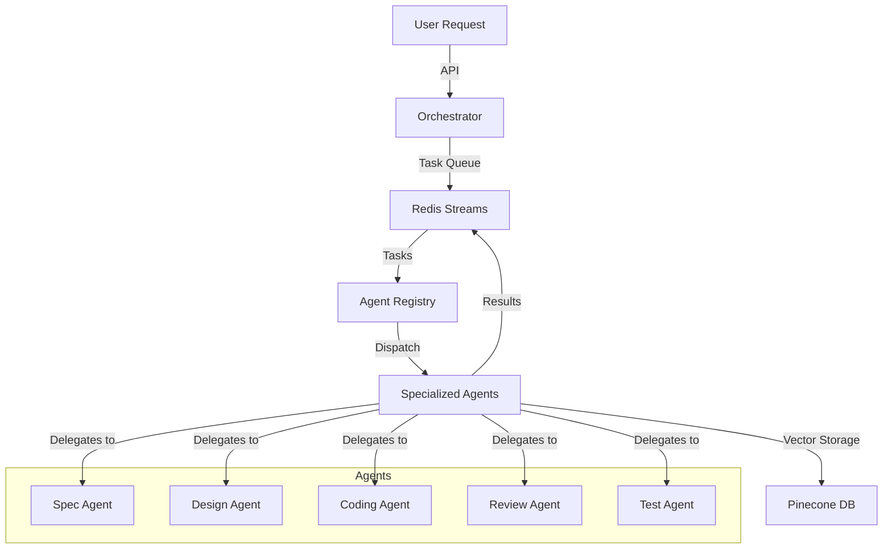

# 🤖 Agent Blackwell

<div align="center">


**A modular LLM-powered agent orchestration system featuring autonomous agents working together via Redis streams and Pinecone vector DB**

</div>

## 🌟 Overview

Agent Blackwell is a cutting-edge orchestration system that harnesses the power of multiple specialized AI agents working in concert to transform requirements into working software. By decomposing complex tasks into specialized workflows, Agent Blackwell delivers higher-quality results than single-LLM approaches, with enhanced reliability, transparency, and control.

### 🚀 Business Value

- **30-50% Productivity Boost** - Automates routine coding tasks, allowing developers to focus on high-level architecture and business-critical features
- **24/7 Development Cycle** - Agents work around the clock, accelerating project timelines dramatically
- **Knowledge Augmentation** - Captures and applies best practices, ensuring consistent quality across projects
- **Scalable Expertise** - Supplements team knowledge with specialized agents trained in security, testing, and optimization
- **Reduced Technical Debt** - Built-in code review and testing agents ensure high-quality output from the start

## 🏗️ Architecture



## 💻 Tech Stack

- **Core Runtime**: Python 3.11+
- **Framework**: FastAPI
- **Agent Technology**: LangChain with GPT-4
- **Message Broker**: Redis Streams
- **Vector Database**: Pinecone
- **Containerization**: Docker
- **Orchestration**: Kubernetes with Helm
- **CI/CD**: CircleCI
- **Monitoring**: Prometheus & Grafana
- **ChatOps**: Slack API Integration

## 🧠 Specialized Agents

- **🔍 Spec Agent**: Transforms user requests into detailed specifications and task lists
- **📐 Design Agent**: Creates architecture diagrams and API contracts
- **👨‍💻 Coding Agent**: Generates production-ready code modules
- **🔬 Review Agent**: Analyzes code for quality, linting issues, and security vulnerabilities
- **🧪 Test Agent**: Scaffolds comprehensive test suites with high coverage

## 🛠️ Getting Started

### Prerequisites

- Python 3.11+
- Redis server
- OpenAI API key
- Pinecone API key

### Installation

```bash
# Clone the repository
git clone https://github.com/yourusername/Agent_Blackwell.git
cd Agent_Blackwell

# Create a virtual environment
python -m venv venv
source venv/bin/activate  # On Windows: venv\Scripts\activate

# Install dependencies
poetry install

# Set up environment variables
export OPENAI_API_KEY="your-openai-key"
export PINECONE_API_KEY="your-pinecone-key"
```

### Running the System

```bash
# Start Redis server (if not already running)
redis-server

# Start the orchestrator
python -m src.orchestrator.main
```

## 📝 Usage Example

```python
from src.orchestrator.main import Orchestrator

# Initialize the orchestrator with your API keys
orchestrator = Orchestrator(
    openai_api_key="your-openai-key",
    pinecone_api_key="your-pinecone-key"
)

# Start the orchestrator
await orchestrator.start()

# Submit a task to the orchestrator
task = {
    "task_id": "feature-request-123",
    "task_type": "spec",
    "payload": {
        "description": "Create a user authentication module with JWT support"
    }
}

# Process the task
result = await orchestrator.process_task(task)
```

## 🧪 Testing

Run the test suite with pytest:

```bash
pytest
```

## 📈 Roadmap

- [ ] CircleCI integration for CI/CD pipeline
- [ ] Kubernetes Helm charts for deployment
- [ ] Slack ChatOps integration
- [ ] Prometheus & Grafana dashboards
- [ ] ML pipeline for agent evaluation and retraining

## 🤝 Contributing

Contributions, issues, and feature requests are welcome! Feel free to check the issues page.

## 📄 License

This project is licensed under the MIT License - see the LICENSE file for details.

---

<div align="center">
Built with ❤️ and AI
</div>
