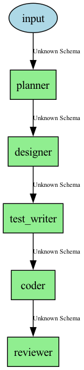
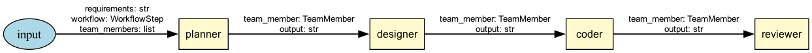
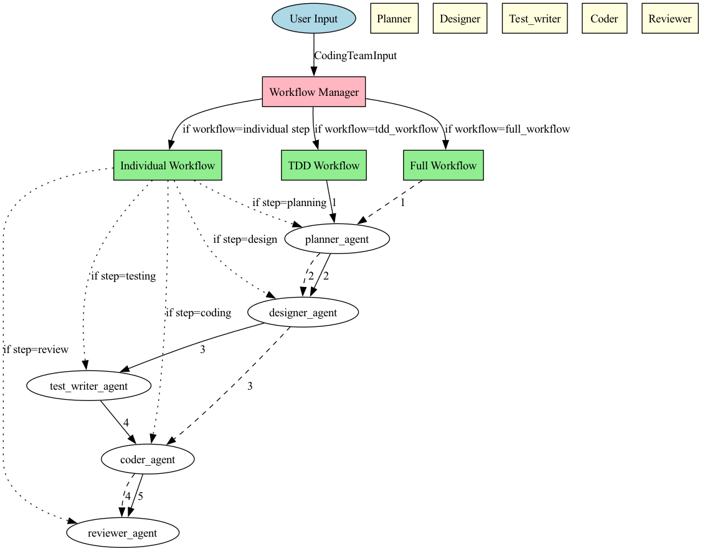

# Workflow Data Flow Documentation

This document provides detailed information about data flow between agents in different workflows.

## TDD Workflow

**Description:** Test-Driven Development workflow (planner → designer → test_writer → coder → reviewer)



### Data Flow Details

#### input → planner_agent

**Schema:**

```
type: initial_input
```

---

#### planner_agent → reviewer_agent

**Schema:**

```
stage: plan
output: plan_output
```

---

#### reviewer_agent → workflow_continuation

**Schema:**

```
decision: approved
stage: plan
```

---

#### designer_agent → reviewer_agent

**Schema:**

```
stage: design
output: design_output
```

---

#### reviewer_agent → workflow_continuation

**Schema:**

```
decision: approved
stage: design
```

---

#### reviewer_agent → designer_agent

**Schema:**

```
decision: revision_needed
stage: design
```

---

#### test_writer_agent → reviewer_agent

**Schema:**

```
stage: tests
output: test_output
```

---

#### reviewer_agent → workflow_continuation

**Schema:**

```
decision: approved
stage: tests
```

---

#### reviewer_agent → test_writer_agent

**Schema:**

```
decision: revision_needed
stage: tests
```

---

#### coder_agent → test_execution

**Schema:**

```
type: test_validation
```

---

#### test_execution → coder_agent

**Schema:**

```
type: test_results
```

---

#### planner_agent → designer_agent

**Schema:**

```
type: sequential
```

---

#### designer_agent → test_writer_agent

**Schema:**

```
type: sequential
```

---

#### test_writer_agent → coder_agent

**Schema:**

```
type: sequential
```

---

## Full Workflow

**Description:** Full development workflow (planner → designer → coder → reviewer)



### Data Flow Details

#### input → planner_agent

**Schema:**

```
type: initial_input
```

---

#### planner_agent → designer_agent

**Schema:**

```
type: sequential
```

---

#### designer_agent → coder_agent

**Schema:**

```
type: sequential
```

---

## Individual Workflow

**Description:** Individual workflow step execution (single agent)


### Data Flow Details

## Complete Workflow System Overview

This diagram shows the entire workflow system architecture and all possible agent interactions:



